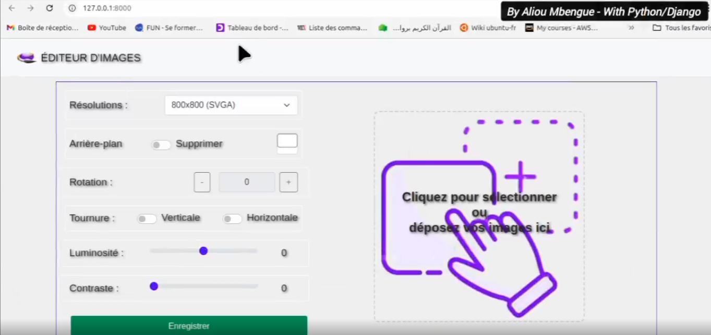
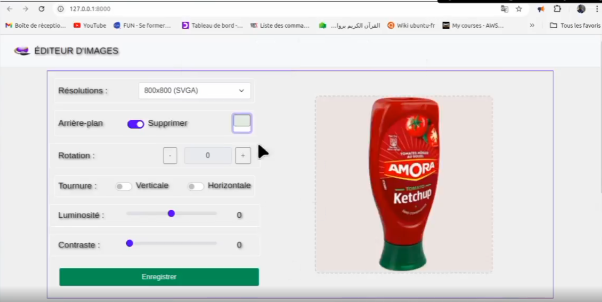
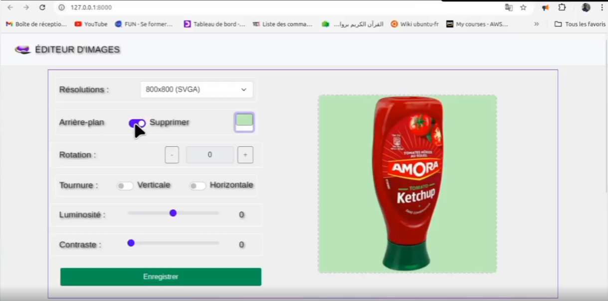
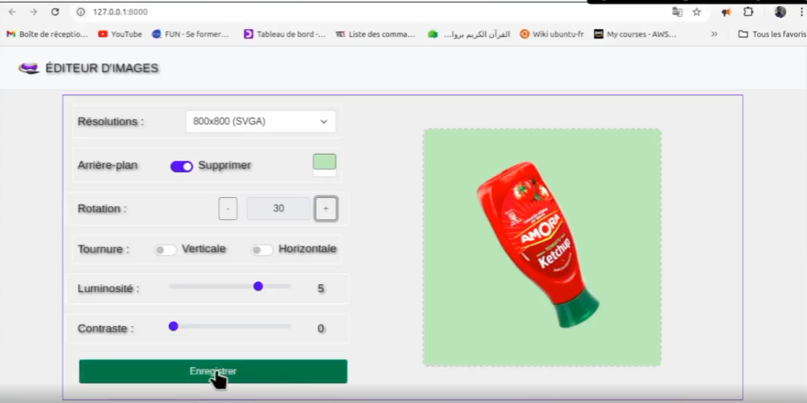

# 🖼️ Images Editor

**Éditeur d’images facile et rapide** développé avec **Django**, permettant de manipuler vos images directement en ligne.

---

## 📌 Description

**ImagesEditor** vous permet de :

* Supprimer des arrière-plans
* Ajouter de nouveaux arrière-plans
* Redimensionner vos images
* Tourner vos images
* Ajuster la luminosité et le contraste

Le tout avec **visualisation en temps réel** pour voir instantanément les modifications.

---

## 🖼️ Captures d’écran

| Capture 1                                                        | Capture 2                                                        | Capture 3                                                        |
| ---------------------------------------------------------------- | ---------------------------------------------------------------- | ---------------------------------------------------------------- |
|  |  |  |

| Capture 4                                                        | Capture 5                                                        |
| ---------------------------------------------------------------- | ---------------------------------------------------------------- |
|  |  |

---

## 🖥️ Technologies utilisées

* **Python 3**
* **Django**
* **Pillow** pour le traitement d’images
* **rembg** pour la suppresion d'arrière plan (AI)
* **Bootstrap / CSS** pour l’interface

---

## 🛠️ Installation

Clonez le projet :

```bash
git clone git@github.com:aliou90/imageseditor.git
cd imageseditor
```

Installez les dépendances :

```bash
pip install -r requirements.txt
```

---

## ▶️ Lancement du serveur

```bash
python manage.py runserver
```

Ouvrez votre navigateur à l’adresse :

```
http://127.0.0.1:8000/
```

---

## ✨ Fonctionnalités principales

### ✔️ Manipulation d’images

* Suppression d’arrière-plan
* Ajout d’arrière-plan personnalisé
* Redimensionnement et rotation

### ✔️ Ajustement visuel

* Luminosité
* Contraste
* Visualisation en temps réel

### ✔️ Interface simple

* Drag & drop pour charger les images
* Aperçu direct des modifications
* Support multi-format (PNG, JPEG, etc.)

---

## 📁 Structure du projet (exemple)

```
imageseditor/
│
├── assets/
│   └── screenshots/
│
├── imageseditor/
│   ├── settings.py
│   ├── urls.py
│   └── ...
│
├── static/
├── templates/
├── manage.py
└── requirements.txt
```

---

## 🧑‍💻 Auteur

**Aliou Mbengue**
GitHub : [@aliou90](https://github.com/aliou90)

